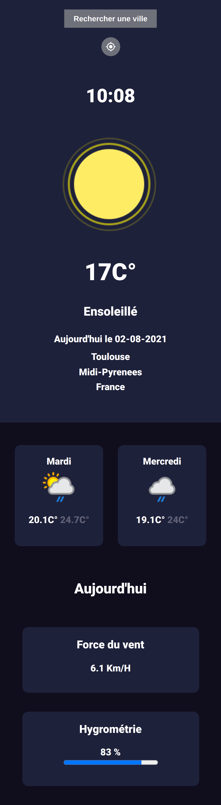
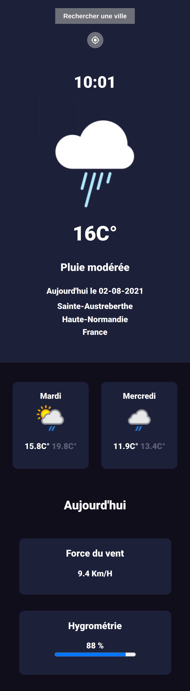
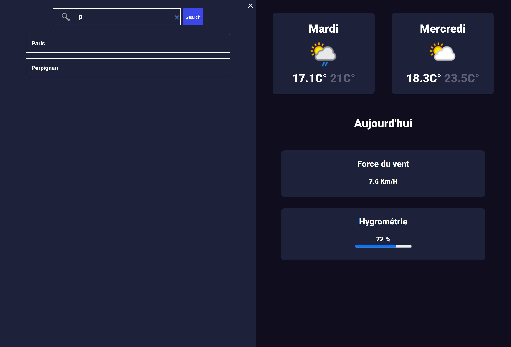

# Application météo:

Premier projet réalisé en React.js, issu d'un challenge de devchallenges.io (et une libre interprétation). Si vous souhaitez retrouver ce challenge, il est disponible à cette adresse :

https://devchallenges.io/challenges/mM1UIenRhK808W8qmLWv

Pour réalisé ce projet, j'ai utilisé l'api météo "weatherapi".

## Pour tester

Directement ici: https://meteo-kevin-gaborel.surge.sh/

N'hésitez pas à tester ce projet, et à me faire un retour.

Pour tester le projet après l'avoir cloné, depuis le terminal faite:

- npm i (pour installer les dépendances)
- npm start (pour lancer le projet)

## Le rendu :

### Version mobile :

### Version desktop :

